# Real Impact of Inflation

Our project is to uncover the difference between the reported and actual urban inflation. We will be using the CPI data, from the Bureau of Labor Statistics, with and without food and energy costs to answer this question. Additionally, we will also be analyzing the differences in inflation between the various US regions, compared to the national average, over time.

## Notebooks
- [Data Exploration](./Data-Exploration.ipynb)
- [Final Data Analysis](./Final-Data-Analysis.ipynb)

## Plots
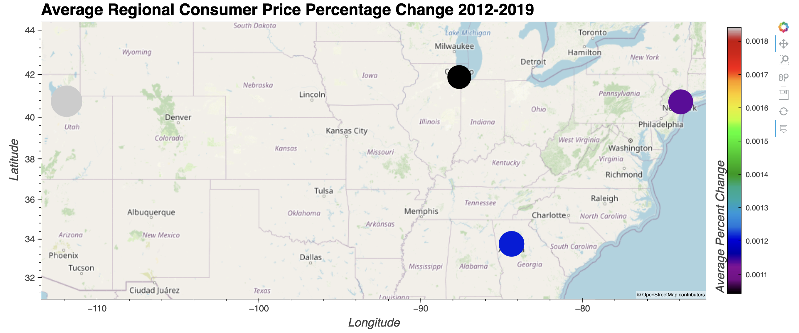
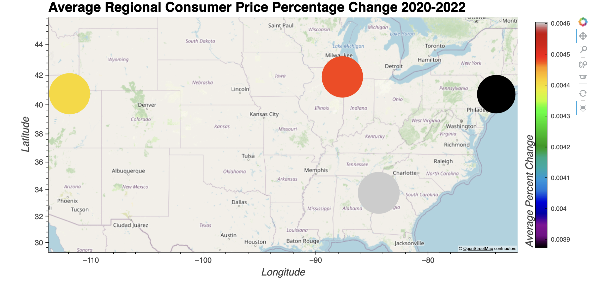
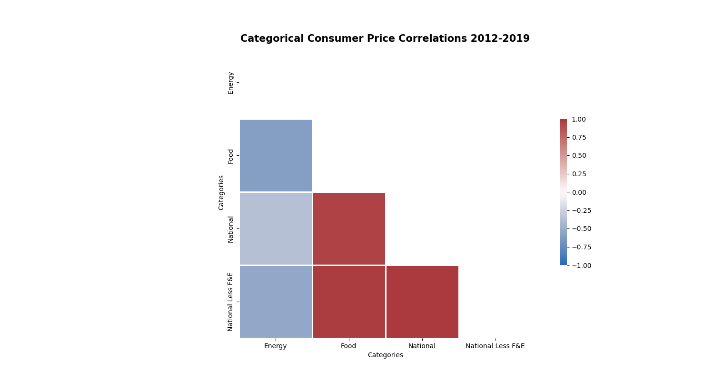
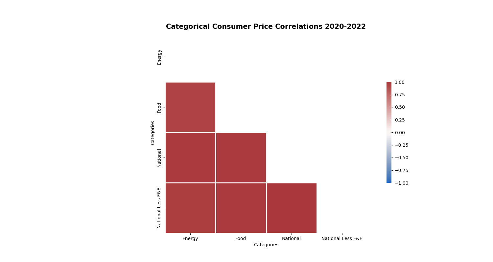
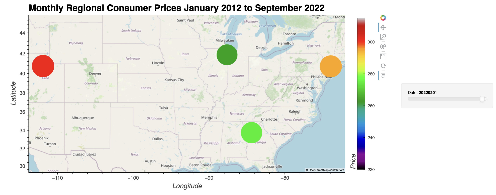
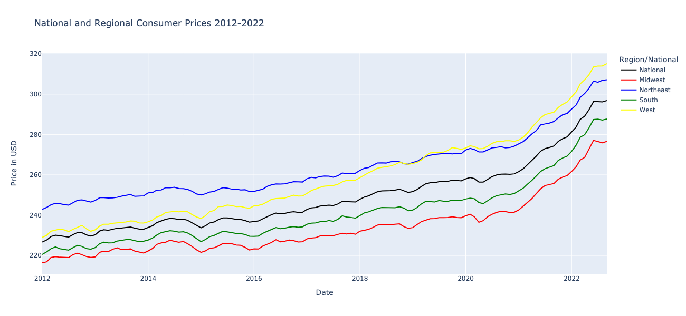

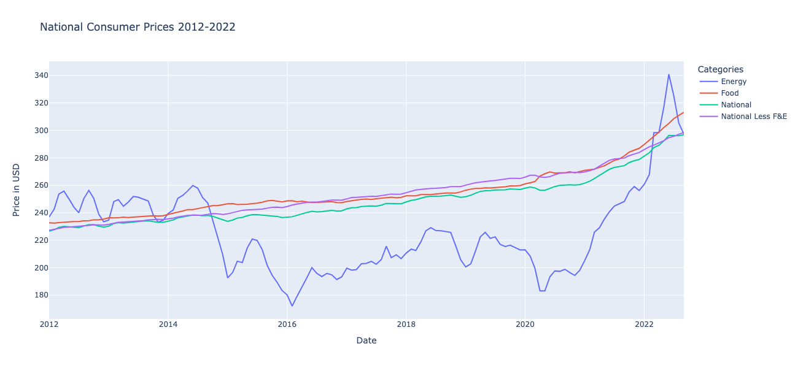
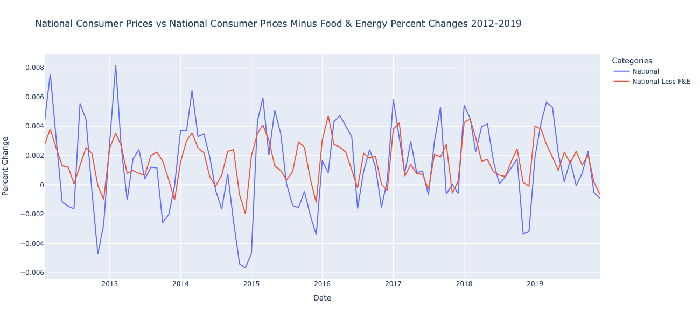
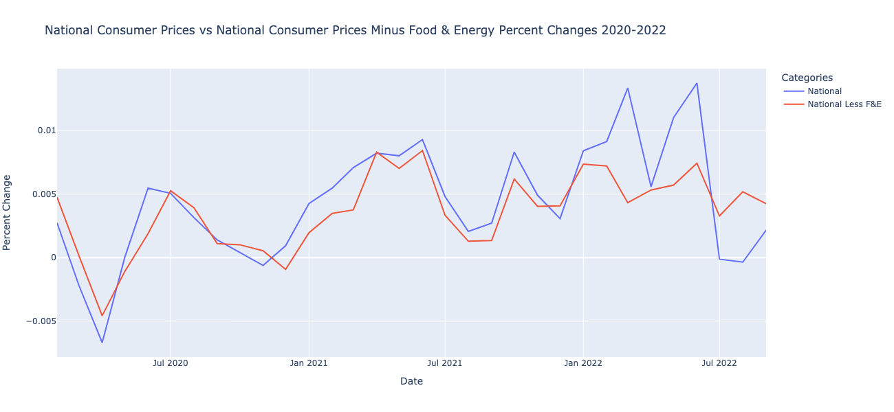
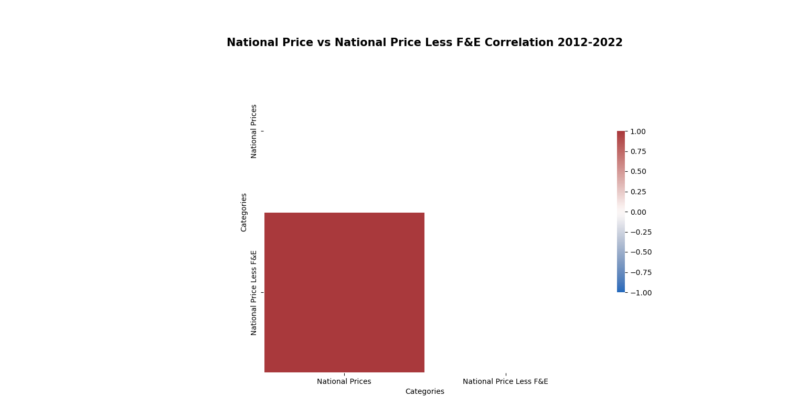
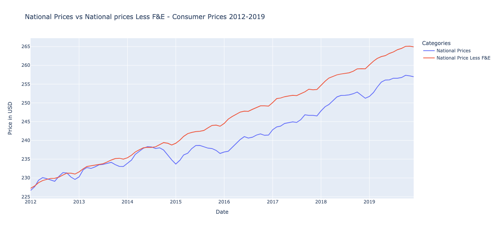
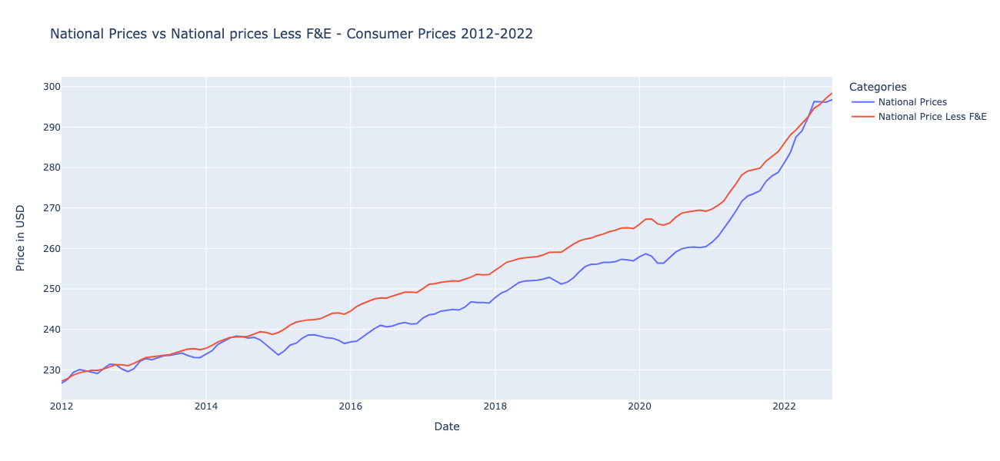
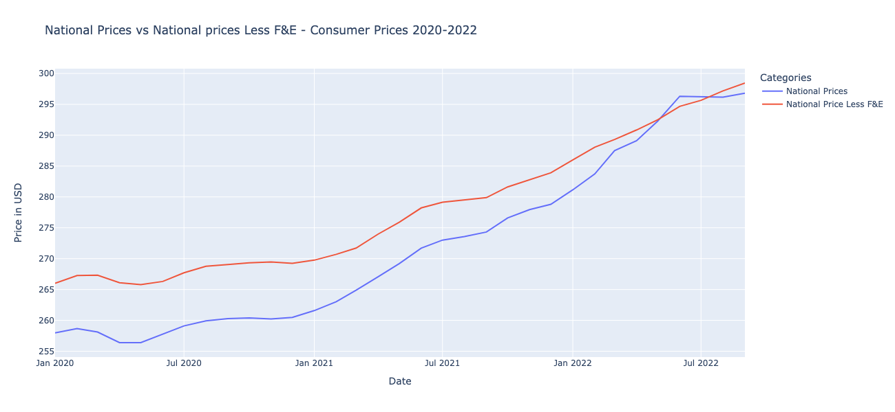
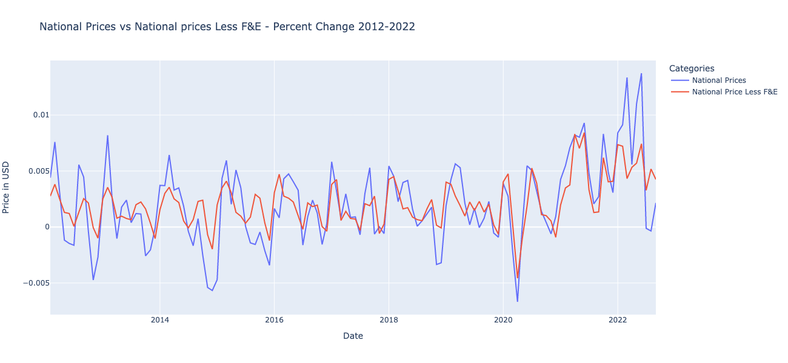
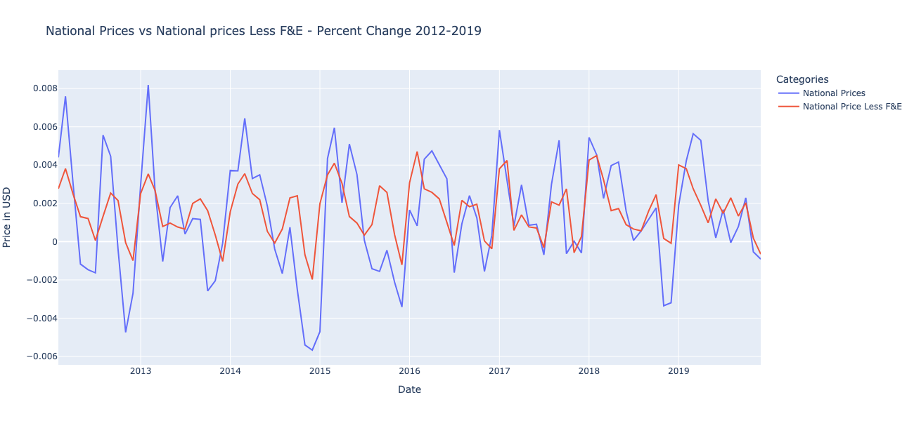
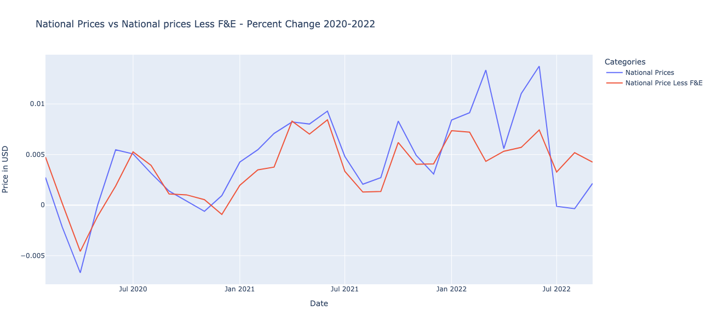
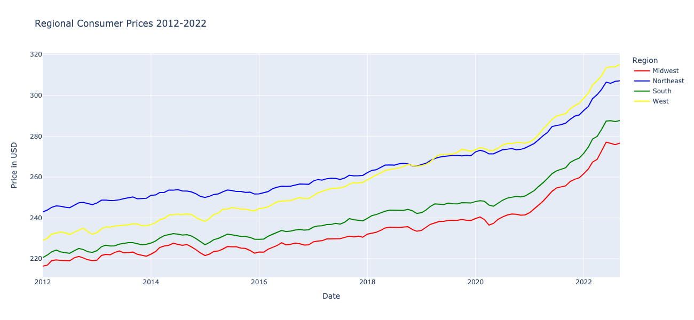


## Getting Started

### Prerequisites

You must have anaconda and conda installed

```
$ anaconda --version
```
*# EXAMPLE OUTPUT: "anaconda Command line client (version 1.11.0)"*
```
$ conda --verison
```
*# EXAMPLE OUTPUT: "conda 22.9.0"*

### Install Environmnet
```
conda create -n real_impact_of_inflation_env anaconda -y
conda activate real_impact_of_inflation_env
conda install -c conda-forge pandas panel geoviews hvplot cartopy pandas-profiling python-kaleido selenium -y
pip install plotly==5.11.0
python -m ipykernel install --user --name real_impact_of_inflation_env
```

### Clone Repository
```
git clone git@github.com:SZun/Real-Impact-of-Inflation.git
cd Real-Impact-of-Inflation
```

## Built With

- [Pandas](https://pandas.pydata.org/docs/#) - Data maniupulation library
- [Numpy](https://numpy.org/) - Multi-dimensional array library
- [Pandas Profiling](https://github.com/ydataai/pandas-profiling) - Generative reporting library
- [Panel](https://panel.holoviz.org/) - Visualization library for dashboards
- [Plotly](https://plotly.com/python/) - Visualization library for plots
- [Hvplot](https://hvplot.holoviz.org/) - Visualization library for Pandas-based plots
- [Geoviews](https://geoviews.org/#) - Visualization library for geographic data
- [Cartopy](https://scitools.org.uk/cartopy/docs/latest/) - Geospacial data processing library
- [Seaborn](https://seaborn.pydata.org/) - Visualization library
- [Pathlib](https://plotly.com/python/) - Python module for paths
- [Datetime](https://plotly.com/python/) - Python module for dates


## Authors
- **Gabriel Millan** - [LinkedIn](https://www.linkedin.com/in/millangabriel/) | [Github](https://github.com/gjmillan)
- **Samuel Farrell** - [LinkedIn](https://www.linkedin.com/in/samuelcfarrell/) | [Github](https://github.com/SamCFarrell)
- **Sami Naeem** - [LinkedIn](https://www.linkedin.com/in/samimuhammad/) | [Github](https://github.com/SZun)
- **Sam G Zun** - [LinkedIn](https://www.linkedin.com/in/szun/) | [Github](https://github.com/SZun)