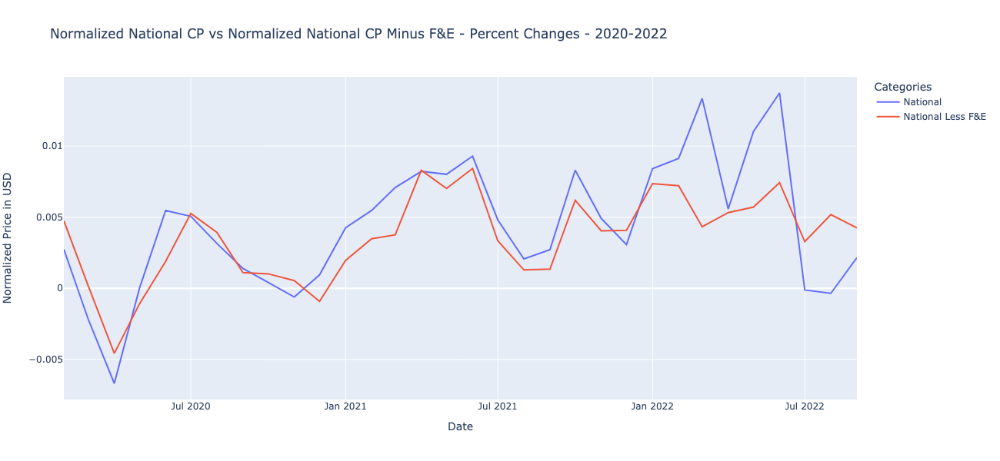

# Real Impact of Inflation
​Our project is to uncover the difference between the reported and actual urban inflation. We will be using the CPI data, from the Bureau of Labor Statistics, with and without food and energy costs to answer this question. Additionally, we will also be analyzing the differences in inflation between the various US regions, compared to the national average, over time.
​
## Questions:
​1. What is the differences between the reported and the actual inflation on a national level?
<br />
2. What is the breakdown of the food and energy components of the actual inflation?
<br />
3. What are the differences in inflation between the four different US regions?

## Notebooks
- [Data Exploration](./Data-Exploration.ipynb)
- [Final Data Analysis](./Final-Data-Analysis.ipynb)

## Plots
​For this project we collected inflation data from 2012-2022. To answer the questions listed above, we analyzed it over the entire period as well as before and after January of 2020. Our diagrams demonstrate a significant increase in general price levels since the outbreak of the Covid-19 pandemic and the war in Ukraine.
​

---
​

​

​

​

​

​


---
​

​

​

​

​




---
​
​


​


​

​

​
## Explanation

### From our three part analysis we have concluded the following:
- Actual and reported inflation have a strong correlation.
- Actual and reported inflation have exhibited a similar linear growth trend. 
- From 2012 to 2022, the price of food increased by approximately 80 normalized price units, while energy by approximitely 60 normalized price units.
- High inflationalry times brings high correlations across all sectors.
- Energy has a very volitile price movement and can therefore have a bigger influence of overall inflation if included in as part of analysis.
- We can conclude that after 2020, the pandemic, we saw a large increase in prices across all sectors and triggering an inflationary trajectory that the economy faces today.
- Prior to January of 2020 prices increaseed by  between .1% and .18% on average per month regionally.
- In the 2020s prices have increased by between .38% and .46% on average per month.
​

## Additional Research Topics
- The impact of inflation can be further researched by investigating:
- The price changes of shelter over time
- The price changes of medical care over time
- The inflation trends, over time, during Democrat or Republican presidencies
- The impact of inflation on the financial security of the average person


## Getting Started

### Prerequisites
​
​You must have anaconda installed

```
$ anaconda --version
```
*# EXAMPLE OUTPUT:* 

```
anaconda Command line client (version 1.11.0)
```
​You must have conda installed

```
$ conda --verison
```
*# EXAMPLE OUTPUT:* 

```
conda 22.9.0
```

### Install Environmnet
```
conda create -n real_impact_of_inflation_env anaconda -y
conda activate real_impact_of_inflation_env
conda install -c conda-forge pandas panel geoviews hvplot cartopy pandas-profiling python-kaleido selenium plotly plotly==5.11.0 -y
python -m ipykernel install --user --name real_impact_of_inflation_env
```

### Clone/Run Repository
```
git clone git@github.com:SZun/Real-Impact-of-Inflation.git
cd Real-Impact-of-Inflation
jupyter lab
```

## Built With

- [Pandas](https://pandas.pydata.org/docs/#) - Data maniupulation library
- [Numpy](https://numpy.org/) - Multi-dimensional array library
- [Pandas Profiling](https://github.com/ydataai/pandas-profiling) - Generative reporting library
- [Panel](https://panel.holoviz.org/) - Visualization library for dashboards
- [Plotly](https://plotly.com/python/) - Visualization library for plots
- [Hvplot](https://hvplot.holoviz.org/) - Visualization library for Pandas-based plots
- [Geoviews](https://geoviews.org/#) - Visualization library for geographic data
- [Cartopy](https://scitools.org.uk/cartopy/docs/latest/) - Geospacial data processing library
- [Seaborn](https://seaborn.pydata.org/) - Visualization library
- [Pathlib](https://plotly.com/python/) - Python module for paths
- [Datetime](https://plotly.com/python/) - Python module for dates
​

## Authors
- **Gabriel Millan** - [LinkedIn](https://www.linkedin.com/in/millangabriel/) | [Github](https://github.com/gjmillan)
- **Samuel Farrell** - [LinkedIn](https://www.linkedin.com/in/samuelcfarrell/) | [Github](https://github.com/SamCFarrell)
- **Sami Naeem** - [LinkedIn](https://www.linkedin.com/in/samimuhammad/) | [Github](https://github.com/SZun)
- **Sam G Zun** - [LinkedIn](https://www.linkedin.com/in/szun/) | [Github](https://github.com/SZun)